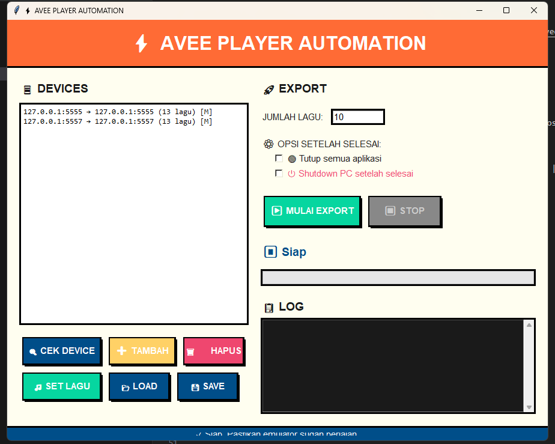

# ⚡ Avee Player Export Automation

> **Automate your Avee Player video exports with one click!**

Tired of manually exporting hundreds of music visualizer videos? This tool automates the entire export process from Avee Player running on Android emulators.

---

## 🎬 Screenshot

---

## ✨ Features

| Feature | Description |
|---------|-------------|
| 🚀 **One-Click Export** | Start automation and let it export all your videos |
| 📱 **Multi-Device Support** | Run on multiple emulators simultaneously |
| 🎨 **Neo-Brutalism UI** | Modern, bold, and beautiful interface |
| 💾 **Profile System** | Save device configurations for quick access |
| ⏱️ **No Timeout Limit** | Waits until export completes, no matter how long |
| 🔄 **Auto-Retry** | Automatically retries on failure |
| 🔴 **Auto Close Apps** | Optional: close all apps when finished |
| ⏻ **Auto Shutdown** | Optional: shutdown PC after completion |
| 📦 **Standalone EXE** | No Python installation required |

---

## 🖥️ System Requirements

- Windows 10/11 (64-bit)
- Android Emulator (MSI App Player / BlueStacks / LDPlayer / MuMu)
- Avee Player installed on emulator
- USB Debugging enabled on emulator

---

## 📥 Installation

### For Buyers

1. Download `AveeAutomation.exe`
2. Double-click to run
3. No installation required!

### Emulator Setup

1. Install Android emulator of your choice
2. Enable **Developer Options**:
   - Settings → About Phone → Tap "Build Number" 7 times
3. Enable **USB Debugging**:
   - Settings → Developer Options → USB Debugging → ON
4. Install **Avee Player** from Play Store
5. Prepare your music and visualization templates

---

## 🚀 How to Use

1. **Start Emulator** - Make sure it's running
2. **Open AveeAutomation.exe**
3. **Click "CEK DEVICE"** - Detect connected emulators
4. **Set number of songs** - How many to export
5. **Click "MULAI EXPORT"** - Start automation
6. **Sit back and relax!** ☕

### Optional Features

- ☑️ **Tutup semua aplikasi** - Auto-close apps when done
- ☑️ **Shutdown PC** - Auto-shutdown after completion (60s delay)

---

## 💰 Pricing

<table>
<tr>
<td align="center">

### 🏷️ **FULL LICENSE**

# Rp 1.000.000

✅ Lifetime access  
✅ Free updates  
✅ Priority support  
✅ Multi-device support  
✅ Commercial use allowed  

</td>
</tr>
</table>

---

## 📞 Contact

For purchase inquiries:

- 📧 Email: [your-email@example.com]
- 💬 WhatsApp: [+62 xxx-xxxx-xxxx]
- 📱 Telegram: [@your_username]

---

## ❓ FAQ

<b>Do I need Python installed?</b>

No! The app is a standalone executable with everything bundled.

<b>Which emulators are supported?</b>

MSI App Player, BlueStacks, LDPlayer, MuMu Player, and any emulator with ADB support.

<b>Can I run on multiple emulators?</b>

Yes! Select multiple devices and the app will run automation on all of them simultaneously.

<b>What if export fails?</b>

The app has built-in auto-retry mechanism. If one export fails, it will retry up to 3 times before moving to the next song.

<b>Is there a trial version?</b>

Contact us for a demo or trial version.

---

## ⚠️ Disclaimer

This tool is for personal productivity use. The developer is not affiliated with Avee Player or any emulator company. Use responsibly.

---

## 📜 License

**Commercial License** - All rights reserved.

Unauthorized distribution, modification, or resale is prohibited.

---

  <b>Made with ❤️ for content creators</b>

